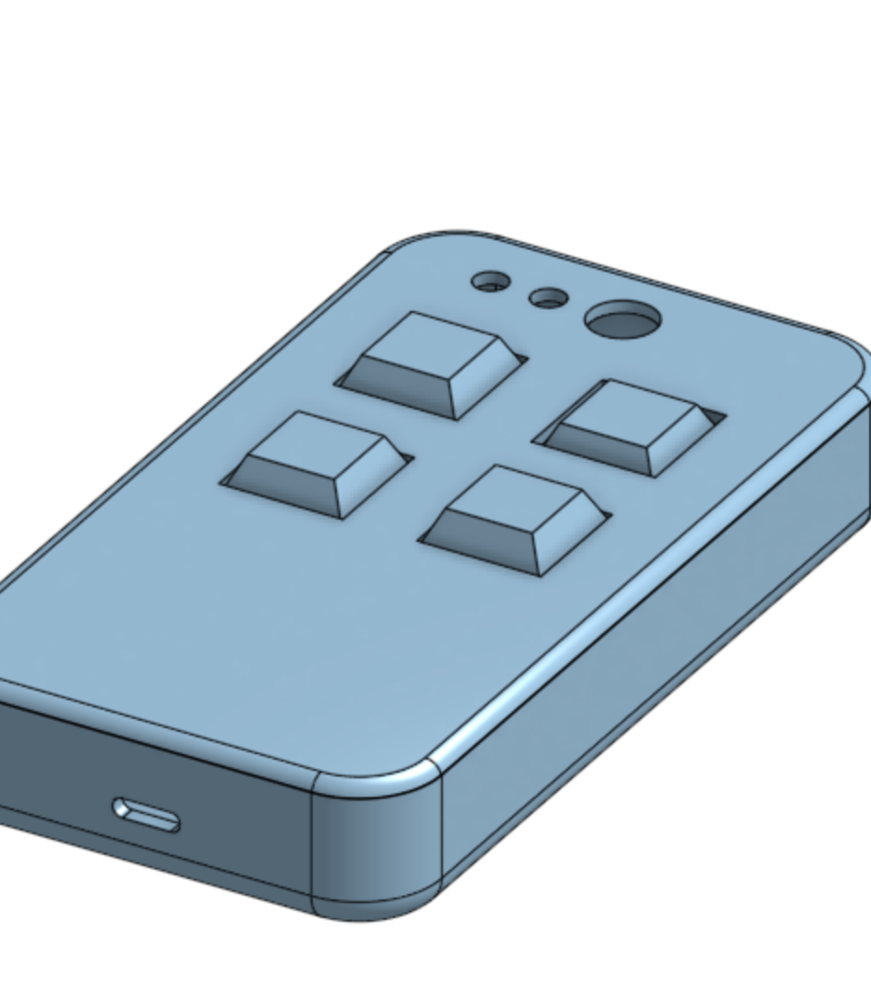
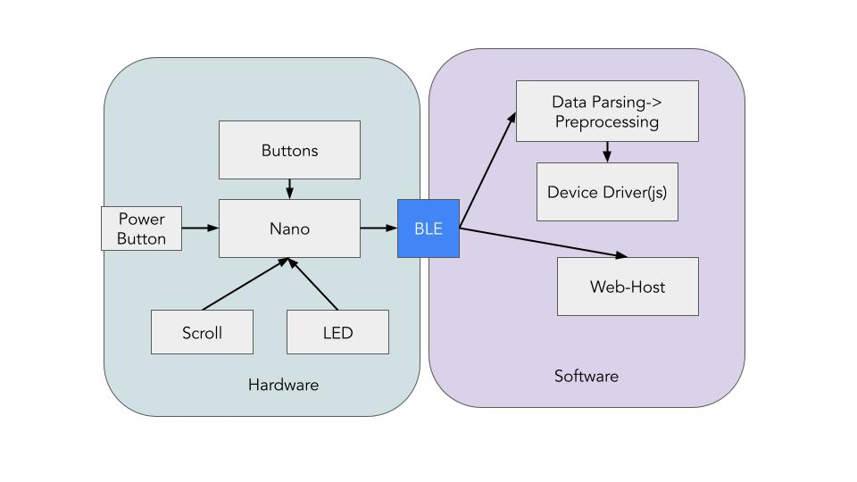

# Keybinds 

## Final Design

### Iteration 1

The current prototype is simple button layout with an on-off button. We are not sure if the customer prefers state LEDs and how charging show me supplied. The initial design featured a simple button layout with an on-off button, and the physical prototype was created using a blue-colored box. This prototype allowed our team to understand basic functionality and gather initial feedback. Although the exact dimensions of the box were flexible, the primary aim was to ensure all elements worked together seamlessly and the design was user-friendly.

We embedded a rechargable USB C port. 

After meeting with our customer, we made the following alterations:
1) The initial design featured a box width of more than 2 inches, but the customer preferred it to be between 1.8 and 2 inches.
2) Initially, the height of the box was standard, but the customer preferred it to be minimized as much as possible to avoid reaching long distances to access the buttons.
3) The initial color of the box was blue, but the customer preferred it to be black.
4) The initial button spacing was flexible, and the customer liked the Onshape model, giving us the freedom to space the buttons as we prefer.
5) Initially, the buttons did not have a toggle feature, but the customer preferred to have button toggles.

### Iteration 2
In the second iteration, the design was refined based on customer feedback. The width of the box was adjusted to fall between 1.8 and 2 inches, and the height was minimized as much as possible to meet ergonomic requirements. This became a concern for how we were going to fit the Arduino Nano, Battery, Buttons, Toggle, On/Off.
Additionally, the design was modified to accommodate a 9V battery based on the dimensions provided by the customer. The color of the box was changed to black as per the customer’s preference. 

As a result, our customer was pleased with the fit of the remote in her hand. We demonstrated the latency as well to the customer and she was happy with it. While she was happy with the buttons, we still needed to test the toggle button. The on/off button was initially placed on the front of the box, but the customer preferred it to be on the top to avoid accidental activation or deactivation when using the other buttons. Placing the on/off button on the front increased the risk of unintentionally turning the device on or off while pressing other buttons, which could disrupt the user experience.

Charging Port now on the the side, and the On/Off button on top to avoid accidental on and off. 

## Testing

### Iteration 1 - System Reliability
During the initial testing phase, we focused on evaluating the reliability of the Bluetooth Low Energy (BLE) connection between the Arduino Nano and the computer. Over the course of one hour, we observed *zero connection drops*. Additionally, we measured the latency in button press to action execution, finding an average latency of 20ms with a standard deviation of 5ms.

### Iteration 2 - Button Response
During the initial testing phase, we focused on evaluating the reliability BLE between the Arduino Nano and the computer. Over the course of one hour, we observed zero connection. Additionally, we measured the latency in button press to action execution, finding an average latency of 20ms with a standard deviation of 5ms.

### Iteration 3 - Physical Comfort/Power Consumption
In the final phase of testing, we assessed the power consumption of the system and evaluated its physical durability. The system was in an active state current draw of 15mA. Based on these measurements, we estimated a battery life of approximately 30 hours under typical usage conditions. The resting conditions proved to be worthwhile.

For comfort, we shared different customizations of grip with the customer. The customer liked this feel the most.

## Design phase 1

### Customer Persona

Two of my favorite hobbies are drawing and playing video games while on voice call with friends. One common issue that comes up when doing either is a lack of keybinds. There’s no comfortable way to draw with the keyboard plugged into the tablet. The games I usually play take up a lot of keybinds, so there isn’t much left over for other applications (ex: Discord Game Overlay Features).  
I want a controller that I can use in my left hand and resting on a table. It needs to have at least 4 buttons I can keybind to. It needs to connect to my computer either via bluetooth or USB-A.

### Customer Survey

Here are some exploratory questions we asked our customer:

**1. Is it a remote that you hold in your hand, or does it sit stationary on a table?**

It should be held in the hand

**2. Should it have buttons or a touchscreen?**

Buttons

**3. Is it plugged in or is it cordless?** (Bluetooth/USBA)

It is wireless and should use bluetooth

**4. What is a good size for the device? How many buttons should it have?**

It should be smaller than a 13 mini, and all buttons should be easily accessible. The buttons should be pretty easy to press.

**5. How many buttons do you want? What do you think is a good number?**

At minimum, a 2x2 grid of buttons. Whats most important is that "I just have to be able to reach it".

**6. What feel should it have? Any particular design?**

Any color works. Good feeling plastic.

**7. What applications do you expect to be using it for?**

Clips studio. Mostly for switching brushes and pressing undo/redo. It will mostly be used for pressing buttons, not for holding them down.

**8. Should the keybinds be static or should it change per application?**

Applications have individual keybind settings. I prefer it to switch automatically.

**9. Anything else that feels important for the product?**

Low latency

**10. How should the buttons feel?**

They should be easy to press, and it is important for them to be placed so I can press all of them.

#### Background search

We found there are small programmable keyboards available for purchase, and there are multiple sizes but there isn't one with 2x2 size as required by the customer. Also, most of them use mechanical keyboard which is not as portable as the customer required. The customer would like a 2x2 size because she wants her hand able to reach all the keys. Many existing keyboards can't switch automatically between apps, and the connections are not stable. Some don't support bluetooth. Some's key dial doesn't support multi-key presses, meaning that each key on mini controller must be the only key on keyboard, it can't be a combination.

### Kano model analysis

The metrics that we chose to track with the Kano model include:

- Low latency - *Linear*
- Automatic keybind switching - *Exciter*
- Physical keybind toggle - *Satisfier*
- Battery powered - *Satisfier*
- Good amount of buttons - *Linear*

### General survey

The method we chose to run the survey was a google form. We surveyed 10 people, with each team member contributing three people, plus the client. The results showed that there is a need for this product, at least within our survey of respondents. This is likely because the product doesn't present any questionable features that would turn away customers. Additionally, the need to have easily accessible keybinds doesn't only exist with drawing, but generally for navigating menus more effectively.

| First  Name | Would you consider buying the  product? | How do you feel if the device is  responsive? (<200ms) | How do you  feel if the device is NOT  responsive? (1s) | How important is it for the  device to have a quick response time? | How do you feel if the profiles  switch automatically based on the application you run? | How do you feel if the profiles  do not switch automatically and it has to be done manually? | How important is it for the  profile to switch automatically? | How do you feel if there is a  physical toggle for switching profiles on the device? | How do you feel if there is no  such toggle? | How important is it for there to  be a physical "profiles" toggle on the device? | How do you feel if the device is  battery powered? | How do you feel if the device is  wired? | How important is it for the  device to be portable? | How do you feel if the device  has 2-4 buttons? | How do you feel if the device  has up to 8 buttons? | How important is the button  count on whether you enjoy the product? |
| ----------- | --------------------------------------- | ------------------------------------------------------ | ------------------------------------------------------- | ------------------------------------------------------------ | ------------------------------------------------------------ | ------------------------------------------------------------ | ------------------------------------------------------------ | ------------------------------------------------------------ | -------------------------------------------- | ------------------------------------------------------------ | -------------------------------------------------- | ---------------------------------------- | --------------------------------------------------- | ----------------------------------------------- | --------------------------------------------------- | ------------------------------------------------------------ |
| Param       | Yes                                     | I expect it                                            | I dislike it                                            | Moderately important                                         | I like it                                                    | I can tolerate it                                            | Somewhat important                                           | I like it                                                    | I am neutral about it                        | Neutral                                                      | I like it                                          | I can tolerate it                        | Very important                                      | I like it                                       | I dislike it                                        | Very important                                               |
| Sudhir      | No                                      | I expect it                                            | I dislike it                                            | Very important                                               | I like it                                                    | I can tolerate it                                            | Moderately important                                         | I can tolerate it                                            | I am neutral about it                      h  | Somewhat important                                           | I am neutral about it                              | I am neutral about it                    | Moderately important                                | I expect it                                     | I like it                                           | Very important                                               |
| Christina   | Yes                                     | I expect it                                            | I dislike it                                            | Very important                                               | I like it                                                    | I am neutral about it                                        | Somewhat important                                           | I like it                                                    | I am neutral about it                        | Moderately important                                         | I dislike it                                       | I like it                                | Not at all important                                | I am neutral about it                           | I can tolerate it                                   | Moderately important                                         |
| Shawn       | No                                      | I like it                                              | I dislike it                                            | Extremely important                                          | I expect it                                                  | I am neutral about it                                        | Somewhat important                                           | I am neutral about it                                        | I am neutral about it                        | Neutral                                                      | I like it                                          | I like it                                | Extremely important                                 | I expect it                                     | I can tolerate it                                   | Moderately important                                         |
| Jonas       | Yes                                     | I expect it                                            | I can tolerate it                                       | Moderately important                                         | I like it                                                    | I am neutral about it                                        | Somewhat important                                           | I am neutral about it                                        | I am neutral about it                        | Neutral                                                      | I am neutral about it                              | I am neutral about it                    | Somewhat important                                  | I am neutral about it                           | I can tolerate it                                   | Somewhat important                                           |
| David       | No                                      | I like it                                              | I can tolerate it                                       | Very important                                               | I expect it                                                  | I like it                                                    | Not at all important                                         | I like it                                                    | I can tolerate it                            | Moderately important                                         | I like it                                          | I dislike it                             | Extremely important                                 | I like it                                       | I am neutral about it                               | Moderately important                                         |
| Aleksa      | No                                      | I expect it                                            | I can tolerate it                                       | Moderately important                                         | I like it                                                    | I expect it                                                  | Not at all important                                         | I like it                                                    | I am neutral about it                        | Moderately important                                         | I expect it                                        | I dislike it                             | Very important                                      | I am neutral about it                           | I expect it                                         | Moderately important                                         |
| Bryson      | Yes                                     | I expect it                                            | I dislike it                                            | Extremely important                                          | I am neutral about it                                        | I am neutral about it                                        | Not at all important                                         | I expect it                                                  | I am neutral about it                        | Moderately important                                         | I expect it                                        | I am neutral about it                    | Slightly importnat                                  | I expect it                                     | I like it                                           | Slightly importnat                                           |
| Jesse       | Yes                                     | I expect it                                            | I dislike it                                            | Somewhat important                                           | I like it                                                    | I can tolerate it                                            | Somewhat important                                           | I expect it                                                  | I am neutral about it                        | Somewhat important                                           | I expect it                                        | I expect it                              | Somewhat important                                  | I am neutral about it                           | I expect it                                         | Somewhat important                                           |
| Angelina    | Yes                                     | I expect it                                            | I dislike it                                            | Extremely important                                          | I like it                                                    | I can tolerate it                                            | Moderately important                                         | I like it                                                    | I can tolerate it                            | Moderately important                                         | I am neutral about it                              | I like it                                | Extremely important                                 | I expect it                                     | I like it                                           | Extremely Important                                          |

https://docs.google.com/presentation/d/187pOIV6F5fnQBTgCIqUqgqFnD4na6_eTl0GMjhVdOS0/edit?usp=sharing

### Design Phase 1 Finding summary

First, we performed a customer needs assessment. We surveyed 10 people of all different backgrounds, meaning not just artists. The main question we asked them is whether they would buy the product and 6 out of 10 people said yes. We asked them about low latency, automatic keybind switching, a physical keybind toggle, whether the device should be battery powered, and what amount of buttons felt right for the device. We performed this using the KANO survey model and we found that having low latency is a must, while everything else is an exciter.

Doing background research, we found out that there are two main ways to approach this problem, either communicating through USB or communicating through Bluetooth. Both require serial communication, though there is a possibility that Bluetooth does not require developing a Windows driver and this is the easier option. Our proposed solution is a versatile battery powered remote with low latency, 4 buttons, and a toggle to switch between keybind options.

Our goal for this project is to make a device that the customer wants to use, to make a device that has a good enough lifespan, and software that can be easily tweaked.

### Design Phase 2

### Customer survey

**Is the Device Stationary?**

- She wants to be able to hold it, but it can also be placed on a table

**What is the button count you want?**

- minimum 4

**How many profiles do you want?**

- Two profiles

**What are some expected used keybinds?**

- **MODE 1** - ClipStudio Paint
  - Undo (Ctrl-Z)
  - Redo (Ctrl-Shift Z)
  - Pencil
  - Eraser
- **MODE 2** - (F1 - F4) - For Gaming Purposes

**Size of the device?**

- about index finger length

**Battery life?**

- Minimum 1hr

**Types of buttons that would feel most comfortable (ordered)?**

1. Controller Buttons
2. Mechanical
3. Remote

------

This feedback did cause us to make some changes to what we envisioned the product to look like. First, instead of accounting for three profiles, we only have to take into account two. This means that we can use a switch instead of a slider of some sort. Additionaly, the buttons that we were going to use changed. Initially, we were going to use clicky buttons, but now we decided to focus more on controller buttons and mechanical buttons.

### Prototype

This initial prototype takes care of all of the communication needs that we have to perform with the remote. Basically, there are three tasks to do in this project. One is to get button inputs. Second is to send those inputs over Bluetooth. And third is to turn that communication into keyboard outputs on the computer. What this project does is the first two parts.

The GIF shows me pressing a button connected to an Arduino Nano and a Bluetooth module, and on my computer, text output is being received. This shows that communication is done wirelessly and that when pressing a button, there is a consistent and expected output.

